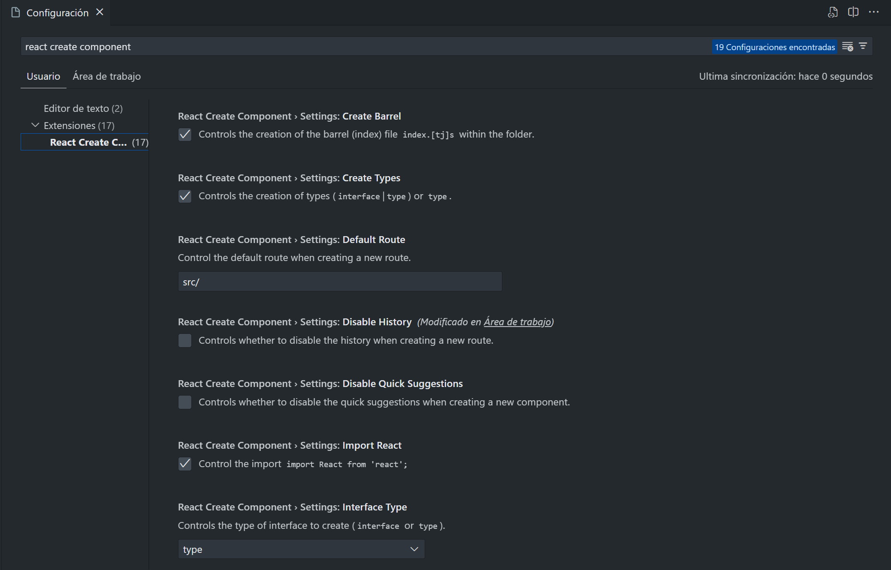

# React Create Component

Generate your components quickly, with multiple easily customizable templates

## Features

- Create a component depending on the selected language.
- Create a style file depending on the type of style or extension selected.
- You can create styles per module.
- You can create a component with built-in style import.
- It generates a barrel in your folder.
- In the tsx files, integrate the interface.

## Commands

| Command               | Description                                    | context         | keybindings      |
| --------------------- | ---------------------------------------------- | --------------- | ---------------- |
| RCC: Create Component | Create a component in the path that you select | palette command | ctrl + shift + l |
| RCC: Delete cache     | Delete the cache of the component creator      | palette command |                  |
| RCC: Create page      | Create a page in the path that you select      | menu context    |                  |

## Integrations

| Integrations         | Technologies                                  |
| -------------------- | --------------------------------------------- |
| Framework or library | [React], [React Native]                       |
| Language             | [Javascript], [Typescript]                    |
| Style extensions     | [CSS], [SASS], [SCSS]                         |
| Styles options       | [CSS Module], [styled-component], tradicional |
| Extras               | [Storybook], [Test] [Testing Library]         |

[React]: https://github.com/facebook/react
[CSS]: https://developer.mozilla.org/es/docs/Web/CSS
[SASS]: https://github.com/sass/sass
[SCSS]: https://github.com/sass/sass
[Typescript]: https://github.com/microsoft/TypeScript
[javascript]: https://developer.mozilla.org/es/docs/Web/JavaScript
[styled-component]: https://github.com/styled-components/styled-components
[CSS Module]: https://github.com/css-modules/css-modules
[React Native]: https://reactnative.dev/
[Storybook]: https://storybook.js.org/
[Test]: https://jestjs.io/
[Testing Library]: https://testing-library.com/

## How does it work?

### Use from a specific path

<video width="100%" height="600" controls>
  <source src="./assets/images/examples/menu.mp4" type="video/mp4">
</video>

You can use it by clicking on the folder where you want your component to be and clicking on the "Create Component" option.

### Use by entering the path

<video width="100%" height="600" controls>
  <source src="./assets/images/examples/palete.mp4" type="video/mp4">
</video>

You can also use it by giving it by executing the "Create Component" command from the command palette
To create a component it can also be executed with the following keys (ctrl + shift + l)

### Quick suggestions

<video width="100%" height="600" controls>
  <source src="./assets/images/examples/su.mp4" type="video/mp4">
</video>

## Settings



You can change the configurations of the templates to make the creation more customizable and faster, for more information go to the [configuration documentation](./docs/settings.md)

## Structure Results

```bash
ComponentFolder
│
│── Component.{jsx, tsx}
│
|── styles(.module).{css, scss, sass}
│
|── Component.stories.{jsx, tsx} [optional]
│
|── Component.test.{jsx, tsx} [optional]
│
└── index.{js, ts}
```

## Example of output with traditional CSS

### Typescript


### CSS


### Barrel


### Testing


### Storybook


### License

React Create Component is [MIT licensed](/LICENSE).
